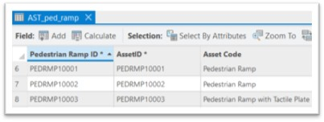
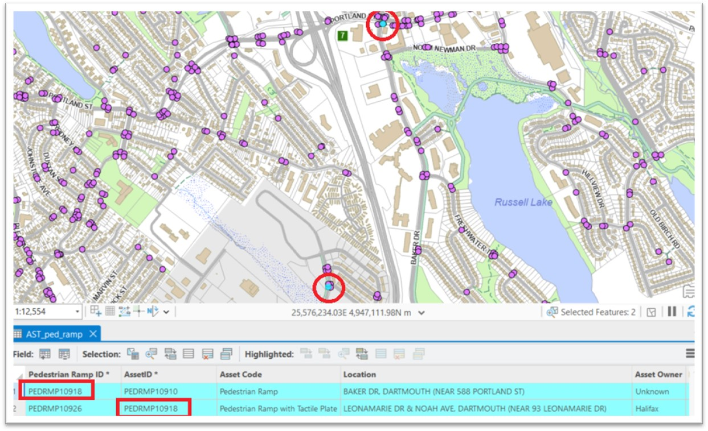
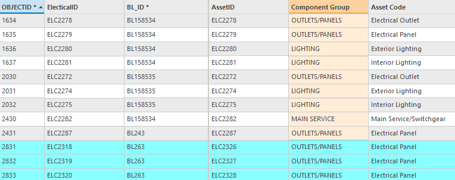
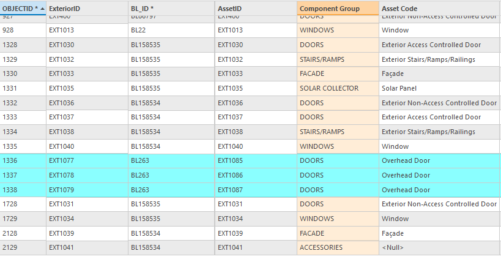
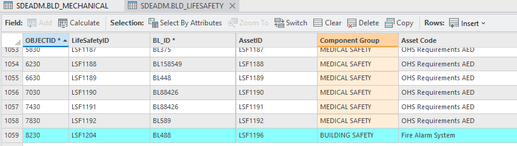
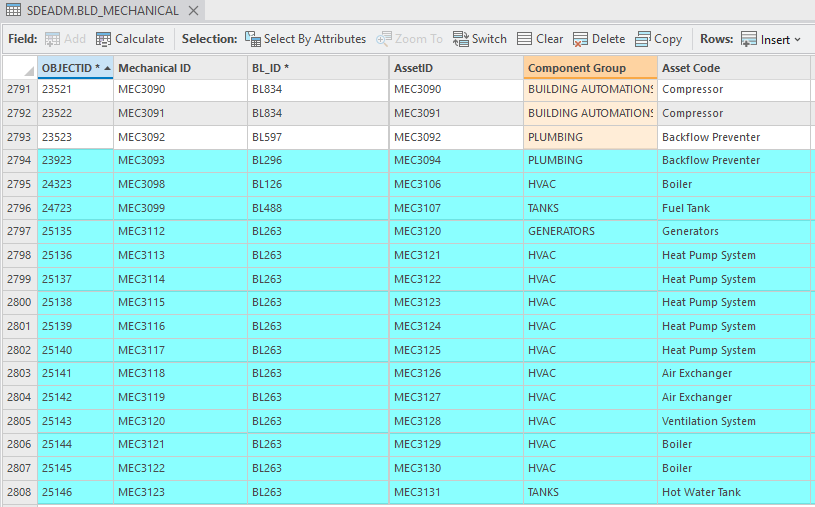

# Email Thread: For April 27 Meeting — Upcoming Asset Identifier Meeting

---

## Kirk's Email

**From:** Mills, Kirk  
**To:** Landry, Jillian  
**CC:** White, Allen  
**Date:** Thursday, April 23, 2026  
**Subject:** Upcoming Asset Identifier Meeting

Kirk's email is the source document for the three issues documented in `issues.md`. It was written ahead of the April 27 meeting with AMO and GIS to align on asset identifier behaviour and remediation options.

See `issues.md` for the full breakdown of Issues A, B, and C.

### Issue B — ASSETID / Asset-Specific ID Mismatch: Example from AST_ped_ramp

The two screenshots below were included by Kirk to illustrate the duplicate ASSETID problem in `AST_ped_ramp`.

**Normal state** — `Pedestrian Ramp ID` and `AssetID` in sync:

**Mismatch example** — two geographically separate features sharing ASSETID `PEDRMP10918`. The feature at Leonamarie Dr / Noah Ave (PEDRMP10926) has inherited the AssetID of the Baker Dr feature, leaving one ASSETID referencing two different physical ramps:

---

## Lisa's Email

**From:** O'Toole, Lisa  
**To:** Landry, Jillian; Marvin, Tristan; Chang, Justin; Gallagher, Alex; Akyol, Reyhan; Potter, Michael  
**Date:** Friday, April 25, 2026 (before the April 27 meeting)  
**Subject:** RE: For April 27 meeting — Upcoming Asset Identifier Meeting

### Summary

Lisa forwarded findings from Justin Chang's investigation of the **Building Component** tables, adding her own high-level observations. She was off on Friday and sent this ahead of the Monday meeting so Alex and Mike could review before it started.

### Key Observations

- **Earliest known occurrence:** 2026-02-09
- **Two categories of tables behave differently:**
  - `BLD_ELECTRICAL` and `BLD_EXTERIOR`: mismatches appear only in records **appended directly to the table**; records added through the Asset Registry Editor are fine.
  - `BLD_LIFESAFETY` and `BLD_MECHANICAL`: mismatches appear in records added through **both** the Asset Registry Editor and direct appends — a wider problem.
- **ASSETID / asset-specific ID out of sync** for appended records across all four tables; in some tables this also affects records added through the Asset Registry Editor.
- **Significant, irregular jumps in Object IDs** throughout the tables — suggesting bulk inserts or sequence resets at specific dates.
- In some tables, Object IDs are **not in chronological order** for records added through the Asset Registry, which is unexpected.

### Table-by-Table Detail (from Justin Chang's report, forwarded by Lisa)

#### BLD_electrical (~3 records affected — direct append, 2026-03-09)

OBJECTID jumped from 2431 → 2831. `ElectricalID` jumped to ELC2318; `AssetID` jumped to ELC2326 — the two sequences diverged, putting the IDs out of sync for all highlighted (cyan) rows.

#### BLD_exterior (~3 records affected — direct append, 2026-03-09)

`AssetID` is out of sync with `ExteriorID` for the highlighted appended records only (e.g. EXT1077 paired with EXT1085). Records added via the Asset Registry Editor are fine. Notably, OBJECTID did not jump on the append date but did jump for Asset Registry records added in 2024, and the Exterior IDs are not sequential relative to ObjectIDs.

#### BLD_lifesafety (1 record affected — Asset Registry Editor, 2026-03-25)

A single record at OBJECTID 8230 shows a significant jump in both ObjectID and LifeSafetyID. `LifeSafetyID` is LSF1204 but `AssetID` is LSF1196 — an offset of 8.

#### BLD_mechanical (~15 records affected — Asset Registry Editor + direct append)

The most complex case. ObjectID jumped ~400 multiple times via the Asset Registry Editor (2026-02-09, 2026-03-06) and then ~412 via direct append (2026-03-09). `AssetID` drifts progressively further out of sync with `Mechanical ID` as ObjectIDs increase — inconsistent with the pattern seen in the other BLD tables.

### Open Question

Justin asked whether **different attribute rules apply for appended records vs. records added through the Asset Registry Editor** — this is the crux of why behaviour differs between the two methods and between tables.
